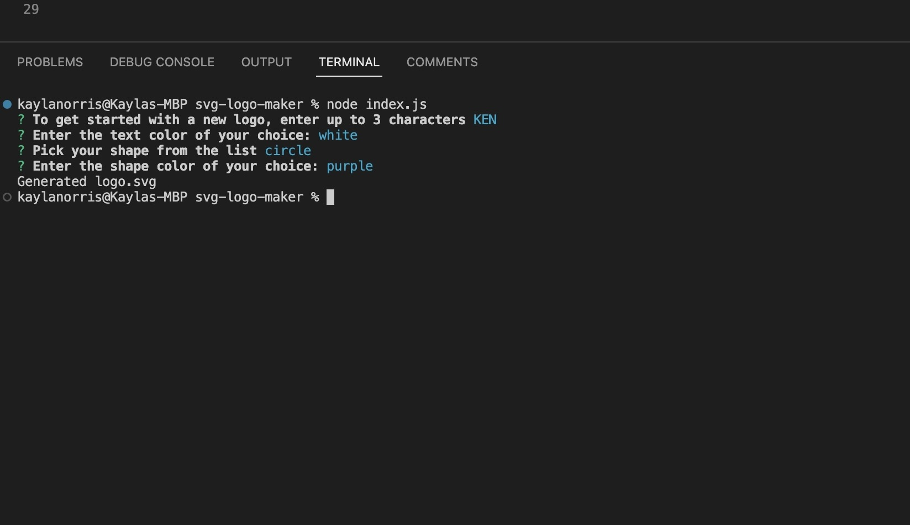
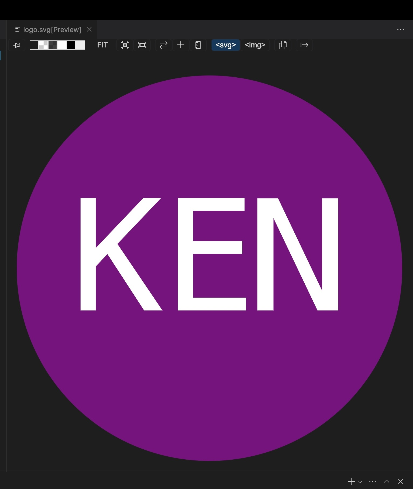

# SVG Logo Maker

## Description
This application was made to create an SVG logo via user prompts in the command line. The logo generated will have a simple monogram style text with your choice of shape and color. 

## Table of Contents
- [SVG Logo Maker](#svg-logo-maker)
  - [Description](#description)
  - [Table of Contents](#table-of-contents)
  - [Installation](#installation)
  - [Usage](#usage)
  - [Credits](#credits)
  - [Prompts Screenshot](#prompts-screenshot)
  - [Completed Logo Screenshot](#completed-logo-screenshot)
  - [Demonstration Video](#demonstration-video)
  - [License](#license)
  - [Questions](#questions)
## Installation

To use this application you will need to have installed VS Code (or a similar code editor), Gitbash (or use the Mac terminal), and Node.js.

To get started: 
- Clone the repository by copying the link under the green code button on GitHub and running "git clone " in the terminal
- Then run the "npm init" command to create a package.json file
- Then run the "npm install inquirer" command to install inquirer to collect user input
- Then run the "npm install jest" command to install jest for testing

## Usage

Once you have the previous steps completed, open the folder in your terminal and run the "node index.js" command to begin the prompts. Follow the prompts and at completion you will recieve a success message in the terminal. Your logo will be automatically generated and available within the examples folder. To run the tests via jest, run the "npm test" command.

## Credits
ChatGPT was used for reference and some code originated from there. [ChatGPT](https://chat.openai.com/chat)

## Prompts Screenshot

## Completed Logo Screenshot

## Demonstration Video
[Click here to view video!](https://www.youtube.com/watch?v=TG2S9OuNa2k)

## License

  
Please refer to the LICENSE file in the repo.

## Questions

For more information, please contact me on [GitHub](https://github.com/KaylaNorris) 
or email me at kayla.e.norris@gmail.com
